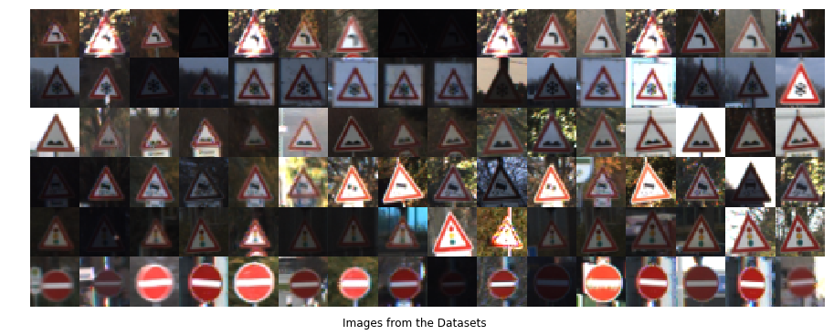
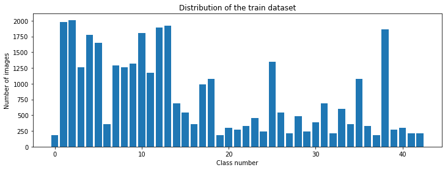
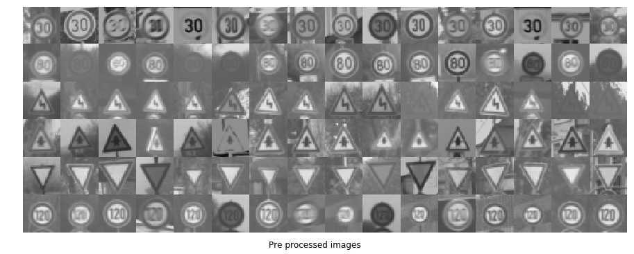
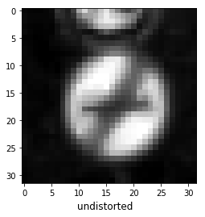
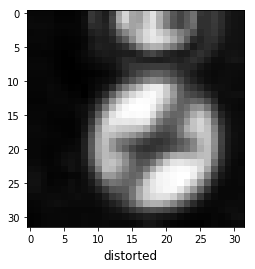
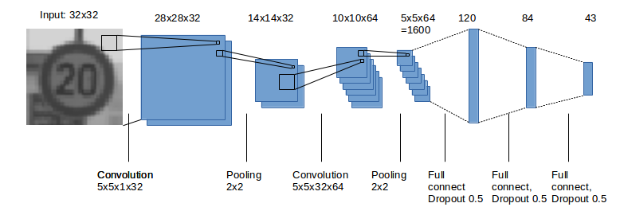

# **Traffic Sign Recognition** 

## Writeup Template

**Build a Traffic Sign Recognition Project**

The goals / steps of this project are the following:
* Load the data set (see below for links to the project data set)
* Explore, summarize and visualize the data set
* Design, train and test a model architecture
* Use the model to make predictions on new images
* Analyze the softmax probabilities of the new images
* Summarize the results with a written report


[//]: # (Image References)

[image4]: ./images/processed/output/speed_limit_30.jpg "Traffic Sign 1"
[image5]: ./images/processed/output/8.jpg "Traffic Sign 2"
[image6]: ./images/processed/output/drive_right.jpg "Traffic Sign 3"
[image7]: ./images/processed/output/no_stop.jpg "Traffic Sign 4"
[image8]: ./images/processed/output/school.jpg "Traffic Sign 5"
[image9]: ./images/processed/output/slippery.jpg "Traffic Sign 6"

## Rubric Points
* **File Submission**
* **Dataset Exploration**
* **Design and Test a Model Architecture**
* **Test Model on New Images**

### Writeup / README
You're reading it! and here is a link to my [project code](https://github.com/udacity/CarND-Traffic-Sign-Classifier-Project/blob/master/Traffic_Sign_Classifier.ipynb)

### File Submission:
 The files needed to be submitted were;
  * This writeup
  * The jupyter notebook associated
### Dataset Exploration: 
The dataset was summarized and shown before preprocessing, after preprocessing and after augmentation, a visualization was also done to show distribution of images per class.

* The data was counted mostly using the python `len()` function.
* 16 images picked in 6 (randomly choosen) classes are first displayed.
* A bar chart is drawn from the data counted in each classes and the minimum, max and average number of images per class is computed.

#### Results
Number of training examples = 34799

Number of validation examples = 4410

Number of testing examples = 12630

Image data shape = (32, 32, 3)

Number of classes = 43






### Design and Test a Model Architecture : 

#### 1. Describe how, and identify where in your code, you preprocessed the image data. What tecniques were chosen and why did you choose these techniques? Consider including images showing the output of each preprocessing technique. Pre-processing refers to techniques such as converting to grayscale, normalization, etc.
 * The class images were normalized and grayscaled using the basic statistic tools, to ease the training and create uniformity through out the classes.

  

#### 2. Describe what your final model architecture looks like including model type, layers, layer sizes, connectivity, etc.) Consider including a diagram and/or table describing the final model.

The data already comes in three parts: training, validation and test set.

The sixth code cell of the IPython notebook contains the code for augmenting the data set.

I have tried several methods of data augmentation but none have made the validation accuracy significantly better, some even made it a little bit worse. However I understood the importance of data augmentation when I first tried the model on some images from the web. The accuracy without data augmentation was as low as 20%. Maybe because the images had different rotation, position or size than in the original dataset. Introducing data augmentation boosted the new image accuracy to 75%.

My data augmentation method is as simple as adding 2 distorted versions of each training image to the training set. Distortion means a random rotation ([-5; -5] degrees), random scale ([0.9; 1.1]) and random translation ([-3; 3] pixels horizontally and vertically).

After distortion some pixels of the image would remain without data. I filled those pixels with 'edge' padding.

My final training set had 104397 images. My validation set and test set had 4410 and 12630 images.

  
  

#### 3. Describe, and identify where in your code, what your final model architecture looks like including model type, layers, layer sizes, connectivity, etc.) Consider including a diagram and/or table describing the final model.

The architecture is deep CNN inspired by two existing architectures: LeNet and Ciresan's paper. Its number and types of layers come from LeNet, but the huge number of filters in c layers came for Ciresan, causing the training and predition to be much faster.



My final model consisted of the following layers:

```
Layer 1: Convolutional (5x5x1x32) Input = 32x32x1. Output = 28x28x32.
Relu activation.
Pooling. Input = 28x28x32. Output = 14x14x32.

Layer 2: Convolutional (5x5x32x64) Input = 14x14x32. Output = 10x10x64.
Relu activation.
Pooling. Input = 10x10x64. Output = 5x5x64.
Flatten. Input = 5x5x64. Output = 1600.
Dropout 0.7.

Layer 3: Fully Connected. Input = 1875. Output = 120.
Relu activation.
Dropout 0.7.

Layer 4: Fully Connected. Input = 120. Output = 84.
Relu activation.
Dropout 0.7.

Layer 5: Fully Connected. Input = 84. Output = 43.
```

#### 4. Describe how, and identify where in your code, you trained your model. The discussion can include the type of optimizer, the batch size, number of epochs and any hyperparameters such as learning rate.

  * The LeNet-5 CNN from the course was implemented with the hyperparameters `mu = 0` and `sigma = 0.1`.
  * The initial `learning_rate = 0.001`, the `batch_size = 128 image`, model was trained for `12 epochs`.
  * TensorFlow design functions were used to train, validate and test the model architecture, training was done through the Adam optimizer.

#### 5.Describe the approach taken for finding a solution. Include in the discussion the results on the training, validation and test sets and where in the code these were calculated. Your approach may have been an iterative process, in which case, outline the steps you took to get to the final solution and why you chose those steps. Perhaps your solution involved an already well known implementation or architecture. In this case, discuss why you think the architecture is suitable for the current problem.

My final model results were:
* training set accuracy of 99.8
* validation set accuracy of 98.4
* test set accuracy of 97.2

If a well known architecture was chosen:
* LeNet-5 CNN architecture was taken
* As it is an image classification problem, convolutional layers were used as it is common in modern image classification systems as reduce computation (as compared to classical neural network with only fc layers). It seems to me that inception moduls are essential for good performance on such kind of tasks as they allow to do not select optimal layer (say, convolution 5x5 or 3x3), by perform different layer types simultaneously and it selects the best one on its own.
* The model is set to be saved on tf if and only if `validation_accuracy > 96%`
 

### Test a Model on New Images

#### 1. Choose five German traffic signs found on the web and provide them in the report. For each image, discuss what quality or qualities might be difficult to classify.

Here are five German traffic signs that I found on the web:

![alt text][image4] ![alt text][image5] ![alt text][image6] 
![alt text][image7] ![alt text][image8] ![alt text][image9]

#### 2. Discuss the model's predictions on these new traffic signs and compare the results to predicting on the test set. At a minimum, discuss what the predictions were, the accuracy on these new predictions, and compare the accuracy to the accuracy on the test set (OPTIONAL: Discuss the results in more detail as described in the "Stand Out Suggestions" part of the rubric).

Here are the results of the prediction:

| Image			        |     Prediction	        					| 
|:---------------------:|:---------------------------------------------:| 
| Speed Limit (30km/h)     		| Speed Limit (30km/h)  									| 
| Speed Limit (60km/h)     			| Speed Limit (60km/h) 										|
| Keep Right					| Keep Right											|
No Vehicles	      		| No Vehicles					 				|
| Children Crossing			| Children Crossing      							|


The model was able to correctly guess 5 of the 5 traffic signs, which gives an accuracy of 100%, but a detailed description can be found in section 3 below. this is not inline with the test results obtained from the model but this is because the 5 images choosen for the tests were really clear and of an acceptable resolution. To reflect the results I have to use worse images than the five choosen.

#### 3. Describe how certain the model is when predicting on each of the five new images by looking at the softmax probabilities for each prediction. Provide the top 5 softmax probabilities for each image along with the sign type of each probability. (OPTIONAL: as described in the "Stand Out Suggestions" part of the rubric, visualizations can also be provided such as bar charts)

You can find these information in the [html notebook](./Traffic_Sign_Classifier.html) in the [source code](./)

For the first image, the model is 100% sure that this is a 30kmph speed limit, The top five soft max probabilities were

Probability|Traffic sign
-------|------
1.0000| Speed limit (30km/h)
0.0000| Speed limit (20km/h)
0.0000| Speed limit (50km/h)
0.0000| Speed limit (70km/h)
0.0000| Speed limit (80km/h)

----------
For the second image, the model is 93.43% sure that this is a 60kmph speed limit, The top five soft max probabilities were:

Probability|Traffic sign
-------|------
0.9343 | Speed limit (60km/h)
0.0654 | Speed limit (80km/h)
0.0003 |Speed limit (50km/h)
0.0000 |Speed limit (30km/h)
0.0000 |Speed limit (120km/h)

----------
For the third image, the model is 100% sure that this is a keep right limit, The top five soft max probabilities were:

Probability|Traffic sign
-------|------
1.0000| Keep right
0.0000| Turn left ahead
0.0000 |Priority road
0.0000 |Beware of ice/snow
0.0000 |Speed limit (80km/h)

----------
For the fourth image, the model is 40.49% sure that this is a keep right sign, The top five soft max probabilities were:

Probability|Traffic sign
-------|------
0.4049 |No vehicles
0.1455 |Keep left
0.0929 |Speed limit (70km/h)
0.0783 |No passing
0.0466 |Turn right ahead

----------
For the fifth image, the model is 100% sure that this is a 30kmph children crossing, The top five soft max probabilities were:

Probability|Traffic sign
-------|------
1.0000| Children crossing
0.0000| Bicycles crossing
0.0000| Right-of-way at the next intersection
0.0000 |Dangerous curve to the right
0.0000 |Beware of ice/snow

-----------
> The visualization (bar-charts) for the data above can be found in the [html file](./Traffic_Sign_Classifier.html) submitted with this
### (Optional) Visualizing the Neural Network (See Step 4 of the Ipython notebook for more details)
#### 1. Discuss the visual output of your trained network's feature maps. What characteristics did the neural network use to make classifications?


